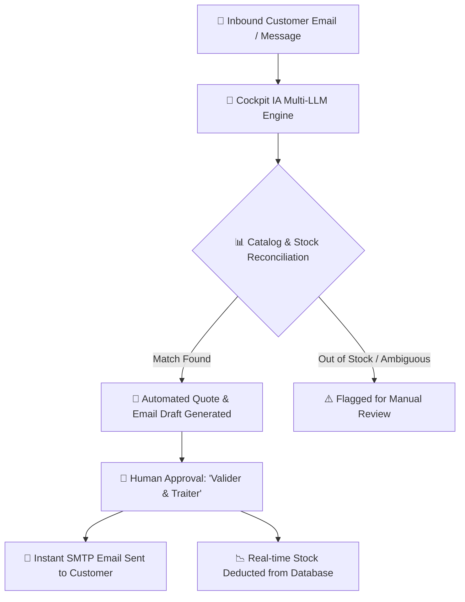

<div align="center">

# ⚡ Cockpit IA (AI Sales & Stock Automation Platform)

**An intelligent, local-first Micro-SaaS for B2B distributors, wholesalers, and SMEs to automate inbound sales requests, quote estimation, stock deduction, and email dispatch in seconds.**

[](https://nextjs.org/)
[](https://www.typescriptlang.org/)
[](https://tailwindcss.com/)
[](https://www.electronjs.org/)
[](https://opensource.org/licenses/MIT)
[]()

[Features](#-key-features) • [Architecture](#-system-architecture) • [Getting Started](#-quick-start) • [Desktop App](#-desktop-app-electron) • [Settings & Connectors](#-connectors--configuration) • [GitHub Release Guide](#-how-to-create-a-github-release)

---

</div>

## 📌 Executive Overview

Small and medium-sized businesses (SMEs) and B2B merchants receive hundreds of unstructured inquiries daily via email, SMS, and contact forms (e.g., *"We need 4 drills and 15 boxes of screws for our site tomorrow"*). Sales teams spend **30% to 40% of their workday** manually checking stock files, recalculating prices, and drafting email responses.

**Cockpit IA eliminates this bottleneck:**
1. **Reads & Understands:** Natural language processing parses customer names, email addresses, intent, urgency, and requested item quantities.
2. **Reconciles Inventory:** Matches natural customer descriptions with your real live product catalog (SKU, Unit Price € HT, Available Stock).
3. **Drafts Quotes:** Generates professional commercial email drafts with accurate totals in € HT.
4. **Human-in-the-Loop 1-Click Approval:** The salesperson reviews the quote, clicks **« Valider & Traiter »**, and Cockpit automatically dispatches the email via SMTP/Nodemailer and deducts the inventory in real-time.

---

## 🌟 Key Features

- **🛡️ Human-in-the-Loop Control:** Zero unvetted automation. Every quote remains under the merchant's supervision before customer delivery.
- **📦 Intelligent Catalog & Stock Engine:**
  - Full support for **Excel (.xlsx, .xls)** and **CSV** drag-and-drop file imports via SheetJS.
  - Live 1-click synchronization with public **Google Sheets**, OneDrive, and SharePoint URLs.
  - Automatic stock deduction upon quote validation.
- **🧠 Multi-LLM AI Core:**
  - Native plug-and-play connectors for **Google Gemini**, **OpenAI (GPT-4o/o3)**, **Anthropic (Claude 3.5)**, **Groq**, **Mistral AI**, **xAI Grok**, and local **Ollama** models.
  - Fallback smart simulation engine operational without requiring an API key for offline demos.
- **📬 Inbound & Outbound Professional Messaging:**
  - Dedicated **Nodemailer SMTP** transport for enterprise deliverability (pre-configured for **turboSMTP**, Gmail Workspace, and Microsoft Outlook 365).
  - IMAP inbox sync for automatic background reading.
- **🖥️ Dual Deployment Model:**
  - **Web SaaS:** Run locally or deploy to Vercel/Node.js servers.
  - **Standalone Windows Desktop App (.exe / .msi):** Packaged with Electron & NSIS installer for 100% offline, local-first data privacy.

---

## 🏛️ System Architecture



---

## 🚀 Quick Start

### Prerequisites
- [Node.js](https://nodejs.org/) (version 18.x or 20.x recommended)
- [npm](https://www.npmjs.com/) (bundled with Node.js)
- [Git](https://git-scm.com/)

### 1. Clone the Repository
```bash
git clone https://github.com/ellsimohammed8-prog/Cockpit-IA.git
cd Cockpit-IA
```

### 2. Install Dependencies
```bash
npm install
```

### 3. Run Web Development Server
```bash
npm run dev
```
Open your browser and navigate to `http://localhost:3000`.

---

## 💻 Desktop App (Electron)

Cockpit IA is fully configured to run and compile as a native Windows desktop application.

### Run in Desktop Mode (Live Development)
```bash
npm run electron:dev
```
*This command starts the Next.js local server and automatically launches the native Electron desktop window.*

### Build Standalone Windows Installer (.exe & .msi)
```bash
npm run build:desktop
```
Once the build completes, your standalone Windows installers will be available in the `dist/` directory:
- `dist/Cockpit IA Setup 0.1.0.exe` (NSIS Installer with desktop shortcut)
- `dist/Cockpit IA 0.1.0.msi` (Windows Installer package)

---

## ⚙️ Connectors & Configuration

Access the **« Paramètres »** modal to configure your environment:

### 1. 🧠 AI Engine
- Select your preferred AI provider (Google Gemini, OpenAI, Claude, Groq, Mistral, Ollama).
- Test connection and fetch live models dynamically with the **« ⚡ Tester la Connexion »** button.
- Custom system prompt editor to tailor extraction rules to your specific industry.

### 2. 📬 Professional Messaging (SMTP & IMAP)
- **turboSMTP / Dedicated SMTP:** Enter your SMTP Host (`pro.eu.turbo-smtp.com`), Port (`465`), Username, and Secret Key.
- **Gmail / Google Workspace:** Generate an App Password at [myaccount.google.com/apppasswords](https://myaccount.google.com/apppasswords).
- **Microsoft Outlook 365:** Use your Microsoft account app password.
- Test real outbound dispatch with **« ⚡ Tester la Connexion & Envoi »**.

### 3. 📊 Catalog & Stock Management
- Drag and drop any `.xlsx`, `.xls`, or `.csv` file with your product columns (*SKU, Name, Stock, Price HT, Category*).
- Or enter a public Google Sheets or online Excel URL to sync unlimited products instantly.

### 4. 🗄️ Database & Storage
- **Local Persistence:** Instant zero-configuration storage.
- **Supabase Cloud (REST):** Scalable cloud persistence.
- **Dedicated PostgreSQL:** Direct connection with SSL support.

---

## 📦 How to Create a GitHub Release

To distribute the `.exe` installer to your clients or users via GitHub Releases:

1. **Build the Desktop Installer:**
   ```bash
   npm run build:desktop
   ```
2. **Push your code to GitHub:**
   ```bash
   git add .
   git commit -m "feat: release Cockpit IA desktop version 0.1.0"
   git push origin main
   ```
3. **Create the Release on GitHub:**
   - Go to your GitHub repository: [https://github.com/ellsimohammed8-prog/Cockpit-IA](https://github.com/ellsimohammed8-prog/Cockpit-IA)
   - Click on **Releases** (on the right sidebar) $\rightarrow$ **Draft a new release**.
   - **Tag version:** `v0.1.0` (Create new tag).
   - **Release title:** `Cockpit IA v0.1.0 - Windows Desktop Installer`
   - **Description:** Paste a brief summary of the release notes.
   - **Attach Binaries:** Drag and drop the generated `dist/Cockpit IA Setup 0.1.0.exe` into the binary upload box.
   - Click **Publish release**.

---

## 🛡️ Security & Privacy

- All API keys, passwords, and connection credentials remain stored locally on your machine or private database.
- Inputs are masked by default (`type="password"`) with eye toggles for inspection.
- Outbound SMTP connections enforce TLS/SSL encryption.

---

## 📄 License

This project is licensed under the **MIT License** — feel free to use and customize for commercial and personal projects.
