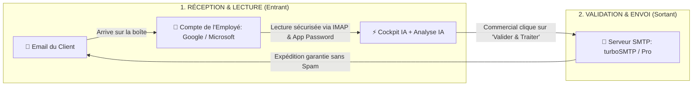

<div align="center">

# ⚡ Cockpit IA — Plateforme d'Automatisation Commerciale & Gestion des Stocks

**Micro-SaaS intelligent et local-first conçu pour les distributeurs B2B, grossistes, négoces et PME afin d'automatiser le traitement des demandes entrantes, le chiffrage des devis, la déduction des stocks et l'envoi d'emails en quelques secondes.**

[](https://nextjs.org/)
[](https://www.typescriptlang.org/)
[](https://tailwindcss.com/)
[](https://www.electronjs.org/)
[](https://opensource.org/licenses/MIT)
[]()

[Fonctionnalités](#-fonctionnalités-clés) • [Architecture](#-architecture-du-système) • [Messagerie (IMAP vs SMTP)](#-architecture-détaillée-de-la-messagerie-imap-vs-smtp) • [Exécution Locale & APIs](#-fonctionnement-des-apis-et-de-lia-sur-serveur-local) • [Démarrage Bureau](#-application-bureau-windows-electron) • [Paramètres](#-paramètres--connecteurs)

---

</div>

## 📌 Présentation Générale

Les PME et entreprises commerciales reçoivent chaque jour des dizaines d'emails désorganisés et non structurés (ex: *« Bonjour, il me faudrait 4 perceuses 18V et 15 boîtes de vis pour notre chantier de demain »*). Les équipes commerciales passent **30% à 40% de leur journée** à chercher manuellement les références dans des fichiers Excel, recalculer les montants HT et rédiger des emails de devis.

**Cockpit IA résout définitivement ce problème :**
1. **Lecture & Compréhension :** Traitement automatique du langage naturel pour extraire le nom du client, son adresse email, l'intention, le niveau d'urgence et les articles demandés.
2. **Réconciliation avec le Stock Réel :** Rapprochement instantané entre les termes du client et votre catalogue officiel (SKU, Prix Unitaire € HT, Stock disponible).
3. **Chiffrage & Rédaction :** Calcul précis du devis et rédaction automatique d'une réponse par email professionnelle et polie.
4. **Validation en 1 Clic (Human-in-the-Loop) :** Le commercial vérifie, clique sur **« Valider & Traiter »**, et Cockpit expédie l'email officiel au client via SMTP/Nodemailer tout en déduisant le stock en temps réel.

---

## 📬 Architecture Détaillée de la Messagerie (IMAP vs SMTP)

L'une des questions fondamentales dans l'automatisation commerciale concerne la différence entre la **lecture** des demandes clients et l'**envoi** des réponses.



### 1. Pourquoi turboSMTP ne peut PAS lire les emails de l'employé ?
* **SMTP (Simple Mail Transfer Protocol)** est un protocole conçu **exclusivement pour l'envoi (Outbound)**.
* Des services comme **turboSMTP** ou **SendGrid** ont pour rôle d'acheminer vos devis et factures vers vos clients avec un taux de délivrabilité maximal afin d'éviter les filtres anti-spam.
* **turboSMTP n'a pas accès à la boîte de réception (Inbox) de l'employé** et ne peut pas lire les messages reçus.

### 2. Comment Cockpit IA lit ce qui est envoyé à l'employé ?
Pour lire les demandes de devis reçues par l'employé, Cockpit IA utilise le protocole **IMAP** (Internet Message Access Protocol) :

* **Si l'employé utilise Google (Gmail / Google Workspace) :**
  1. Activer la validation en deux étapes sur son compte Google.
  2. Générer un **Mot de passe d'application** sur [myaccount.google.com/apppasswords](https://myaccount.google.com/apppasswords) nommé *« Cockpit IA »*.
  3. Saisir son adresse email et les 16 caractères du mot de passe dans Cockpit IA.
  4. Cockpit IA se connecte au serveur `imap.gmail.com:993`, récupère les nouveaux messages non lus et les analyse automatiquement grâce à l'IA.

* **Si l'employé utilise Microsoft (Outlook / Office 365) :**
  1. Se connecter à [account.live.com/proofs/AppPassword](https://account.live.com/proofs/AppPassword).
  2. Générer un mot de passe d'application.
  3. Cockpit IA se connecte via `outlook.office365.com:993` pour relever les demandes entrantes.

---

## ⚡ Fonctionnement des APIs et de l'IA sur Serveur Local

**Toutes les APIs et fonctionnalités de Cockpit IA fonctionnent à 100% sur un serveur local (`localhost`) :**

1. **Appels d'Intelligence Artificielle (Gemini, Claude, GPT, Groq, Ollama) :**
   * Le serveur local Node.js / Next.js émet des requêtes HTTPS sécurisées vers les APIs des modèles d'IA sélectionnés et reçoit les résultats instantanément.
2. **Gestion des Stocks & Fichiers Excel :**
   * Tout est traité localement à très haute vitesse via SheetJS (`xlsx`) sans dépendance cloud obligatoire.
3. **Bases de Données :**
   * Fonctionne en local (in-memory / persistant), ou connecté à **Supabase** ou un serveur **PostgreSQL** dédié.
4. **Envois SMTP :**
   * Nodemailer se connecte directement aux serveurs SMTP distants depuis votre machine.

---

## 💻 Application Bureau Windows (Electron)

Cockpit IA intègre désormais un **gestionnaire intelligent de sous-processus** :

### ✨ Démarrage Automatique du Serveur Local (Zéro Écran Noir)
* Lorsque vous lancez l'application de bureau, Electron vérifie automatiquement la disponibilité de `http://localhost:3000`.
* Si le serveur n'est pas encore actif, **Electron démarre automatiquement le serveur local en arrière-plan** tout en affichant un écran d'attente animé et dynamique.
* Dès que le moteur est prêt, l'interface complète de Cockpit IA apparaît instantanément.
* À la fermeture de la fenêtre, le serveur en arrière-plan est arrêté proprement.

### Lancement Rapide :
* **Option 1 (Bureau Windows Direct) :** Double-cliquez sur [`start-desktop.bat`](file:///c:/Users/WINDOWS%2011/Desktop/skills/start-desktop.bat) ou lancez `npm run electron:dev`.
* **Option 2 (Navigateur Web) :** Double-cliquez sur [`start-web.bat`](file:///c:/Users/WINDOWS%2011/Desktop/skills/start-web.bat) puis ouvrez `http://localhost:3000`.

### Compiler le Fichier d'Installation Windows (.exe) :
```bash
npm run build:desktop
```
L'installeur officiel est généré dans `dist/Cockpit IA Setup 0.1.5.exe`.

---

## ⚙️ Paramètres & Connecteurs

Cliquez sur l'icône **« Paramètres »** (en haut à droite) pour configurer :

### 1. 🧠 Moteur IA
- Sélectionnez votre fournisseur (Google Gemini, OpenAI, Claude, Groq, Mistral, Ollama).
- Cliquez sur **« ⚡ Tester la Connexion »** pour charger les modèles disponibles en direct.

### 2. 📬 Messagerie Professionnelle
- **Pour l'envoi de devis :** Choisissez **turboSMTP** ou serveur personnalisé et renseignez vos clés d'envoi.
- **Pour la réception :** Choisissez **Gmail** ou **Outlook** et collez votre *Mot de passe d'application*.
- Cliquez sur **« 📥 Relever les emails maintenant »** pour traiter immédiatement les nouvelles demandes.

### 3. 📊 Catalogue Produits
- Glissez-déposez vos fichiers `.xlsx`, `.xls` ou `.csv`.
- Ou collez l'URL d'un Google Sheets public pour une synchronisation en temps réel.

---

## 🛡️ Sécurité & Confidentialité

- Toutes vos clés API et identifiants sont chiffrés et stockés localement sur votre ordinateur.
- Vos données commerciales et fichiers clients ne sont jamais partagés avec des tiers non autorisés.

---

## 📄 Licence

Projet sous licence **MIT** — Libre pour utilisation commerciale et privée.
