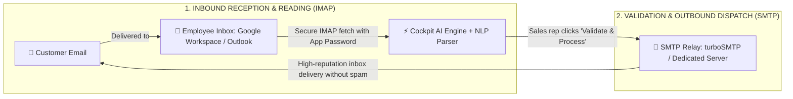
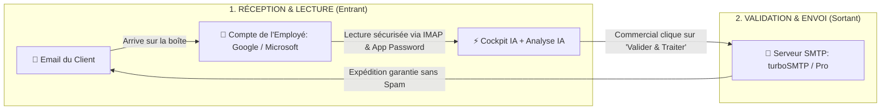

<div align="center">

# ⚡ Cockpit IA / Cockpit AI
### Commercial Automation & Inventory Synchronization Platform
### Plateforme d'Automatisation Commerciale & Gestion des Stocks

**Intelligent, local-first platform designed for B2B distributors, wholesalers, traders, and SMEs to automate inbound RFQ processing, quote estimation, real-time inventory reconciliation, and high-deliverability email dispatching in seconds.**

**Micro-SaaS intelligent et local-first conçu pour les distributeurs B2B, grossistes, négoces et PME afin d'automatiser le traitement des demandes entrantes, le chiffrage des devis, la déduction des stocks et l'envoi d'emails en quelques secondes.**

[](https://nextjs.org/)
[](https://www.typescriptlang.org/)
[](https://tailwindcss.com/)
[](https://www.electronjs.org/)
[](https://opensource.org/licenses/MIT)
[]()

---

**🌐 [English Documentation](#-english) • [Documentation en Français](#-français)**

---

</div>

---

# 🇬🇧 English

## 📌 Executive Overview

B2B companies, distributors, and sales teams receive dozens of unstructured customer quotation requests and emails daily (e.g. *"Hello, we urgently need 4 cordless drills 18V and 15 boxes of stainless screws for tomorrow's job site"*). Sales representatives spend **30% to 40% of their workday** manually searching product SKUs in Excel spreadsheets, calculating prices excl. VAT, checking warehouse stock, and drafting repetitive quote emails.

**Cockpit AI solves this friction end-to-end:**
1. **Intelligent Inbound Ingestion:** Natural Language Processing (NLP) extracts customer identity, contact email, purchasing intent, urgency, and requested item quantities.
2. **Real-time Stock Catalog Reconciliation:** Instant semantic matching between customer wording and your official catalog (SKU, Unit Price excl. VAT, available inventory).
3. **Automated Quotation & Email Drafting:** Calculates line subtotals, VAT, total amounts, and generates polished quotation response emails.
4. **1-Click Human-in-the-Loop Validation:** The sales rep reviews, adjusts if necessary, and clicks **"Validate & Process"** — Cockpit AI immediately dispatches the formal email to the customer via SMTP/Nodemailer and deducts warehouse stock in real time.

---

## 📬 Email Architecture: Inbound (IMAP) vs. Outbound (SMTP)

A common question in enterprise automation is the separation between **reading inbound customer emails** and **sending quotation responses**.



### 1. Why Can't turboSMTP Read Incoming Employee Emails?
* **SMTP (Simple Mail Transfer Protocol)** is strictly an **outbound sending protocol**.
* Specialized relays such as **turboSMTP** guarantee that your quotations and invoices bypass spam filters and land directly in client inboxes with high sender reputation.
* **turboSMTP does NOT have access to the employee's inbox** and cannot read received messages.

### 2. How Does Cockpit AI Read Incoming Emails?
Cockpit AI uses the standard **IMAP (Internet Message Access Protocol)**:
* **For Google (Gmail / Google Workspace):**
  1. Enable 2-Step Verification on your Google account.
  2. Generate an **App Password** named *"Cockpit AI"* on [myaccount.google.com/apppasswords](https://myaccount.google.com/apppasswords).
  3. Paste your email address and the 16-character password into Cockpit AI.
  4. Cockpit AI connects to `imap.gmail.com:993`, detects unread RFQ messages, and parses them with AI.
* **For Microsoft (Outlook / Office 365):**
  1. Navigate to [account.live.com/proofs/AppPassword](https://account.live.com/proofs/AppPassword).
  2. Generate an App Password and connect via `outlook.office365.com:993`.

---

## 💻 Windows Desktop Application & Quick Start

Cockpit AI includes an embedded Next.js HTTP server and an automated process lifecycle manager:

### Quick Launch Options:
* **Option 1 (Windows Desktop App):** Double-click [`start-desktop.bat`](file:///c:/Users/WINDOWS%2011/Desktop/skills/start-desktop.bat) or run `npm run electron:dev`.
* **Option 2 (Web Browser):** Double-click [`start-web.bat`](file:///c:/Users/WINDOWS%2011/Desktop/skills/start-web.bat) and open `http://localhost:3000`.

### Build Standalone Windows Installer (.exe):
```bash
npm run build:desktop
```
The official installer is generated in `dist/Cockpit IA Setup 0.1.5.exe`.

---

## ⚙️ Settings & Connectors

Click the **"Settings"** button (top-right) to configure:
1. **🧠 AI Engine:** Select provider (Google Gemini, OpenAI GPT, Anthropic Claude, Groq, Mistral, Ollama) and customize system prompts.
2. **📬 Professional Email:** Set up IMAP for inbound reading and SMTP/turboSMTP for quotation delivery.
3. **📊 Catalog & Inventory:** Drag & drop `.xlsx`, `.xls`, or `.csv` files, or sync live with public Google Sheets.
4. **🗄️ Database:** Choose between Local SQLite/JSON storage, Supabase Cloud, or Dedicated PostgreSQL.

---

<br/>

---

# 🇫🇷 Français

## 📌 Présentation Générale

Les PME et entreprises commerciales reçoivent chaque jour des dizaines d'emails désorganisés et non structurés (ex: *« Bonjour, il me faudrait 4 perceuses 18V et 15 boîtes de vis pour notre chantier de demain »*). Les équipes commerciales passent **30% à 40% de leur journée** à chercher manuellement les références dans des fichiers Excel, recalculer les montants HT et rédiger des emails de devis.

**Cockpit IA résout définitivement ce problème :**
1. **Lecture & Compréhension :** Traitement automatique du langage naturel pour extraire le nom du client, son adresse email, l'intention, le niveau d'urgence et les articles demandés.
2. **Réconciliation avec le Stock Réel :** Rapprochement instantané entre les termes du client et votre catalogue officiel (SKU, Prix Unitaire € HT, Stock disponible).
3. **Chiffrage & Rédaction :** Calcul précis du devis et rédaction automatique d'une réponse par email professionnelle et polie.
4. **Validation en 1 Clic (Human-in-the-Loop) :** Le commercial vérifie, clique sur **« Valider & Traiter »**, et Cockpit expédie l'email officiel au client via SMTP/Nodemailer tout en déduisant le stock en temps réel.

---

## 📬 Architecture Détaillée de la Messagerie (IMAP vs SMTP)



### 1. Pourquoi turboSMTP ne peut PAS lire les emails de l'employé ?
* **SMTP (Simple Mail Transfer Protocol)** est un protocole conçu **exclusivement pour l'envoi (Outbound)**.
* Des services comme **turboSMTP** ont pour rôle d'acheminer vos devis et factures vers vos clients avec un taux de délivrabilité maximal afin d'éviter les filtres anti-spam.
* **turboSMTP n'a pas accès à la boîte de réception (Inbox) de l'employé** et ne peut pas lire les messages reçus.

### 2. Comment Cockpit IA lit ce qui est envoyé à l'employé ?
Pour lire les demandes de devis reçues par l'employé, Cockpit IA utilise le protocole **IMAP** (Internet Message Access Protocol) :
* **Si l'employé utilise Google (Gmail / Google Workspace) :**
  1. Activer la validation en deux étapes sur son compte Google.
  2. Générer un **Mot de passe d'application** sur [myaccount.google.com/apppasswords](https://myaccount.google.com/apppasswords) nommé *« Cockpit IA »*.
  3. Saisir son adresse email et les 16 caractères du mot de passe dans Cockpit IA.
  4. Cockpit IA se connecte au serveur `imap.gmail.com:993`, récupère les nouveaux messages non lus et les analyse automatiquement.
* **Si l'employé utilise Microsoft (Outlook / Office 365) :**
  1. Se connecter à [account.live.com/proofs/AppPassword](https://account.live.com/proofs/AppPassword).
  2. Générer un mot de passe d'application et renseigner les champs dans Cockpit IA.

---

## 💻 Application Bureau Windows (Electron)

### Lancement Rapide :
* **Option 1 (Bureau Windows Direct) :** Double-cliquez sur [`start-desktop.bat`](file:///c:/Users/WINDOWS%2011/Desktop/skills/start-desktop.bat) ou lancez `npm run electron:dev`.
* **Option 2 (Navigateur Web) :** Double-cliquez sur [`start-web.bat`](file:///c:/Users/WINDOWS%2011/Desktop/skills/start-web.bat) puis ouvrez `http://localhost:3000`.

### Compiler le Fichier d'Installation Windows (.exe) :
```bash
npm run build:desktop
```
L'installeur officiel est généré dans `dist/Cockpit IA Setup 0.1.5.exe`.

---

## 🛡️ Sécurité & Licence

- Toutes vos clés d'API et identifiants de messagerie sont stockés localement sur votre machine.
- Projet sous licence **MIT** — Libre pour utilisation commerciale et privée.
