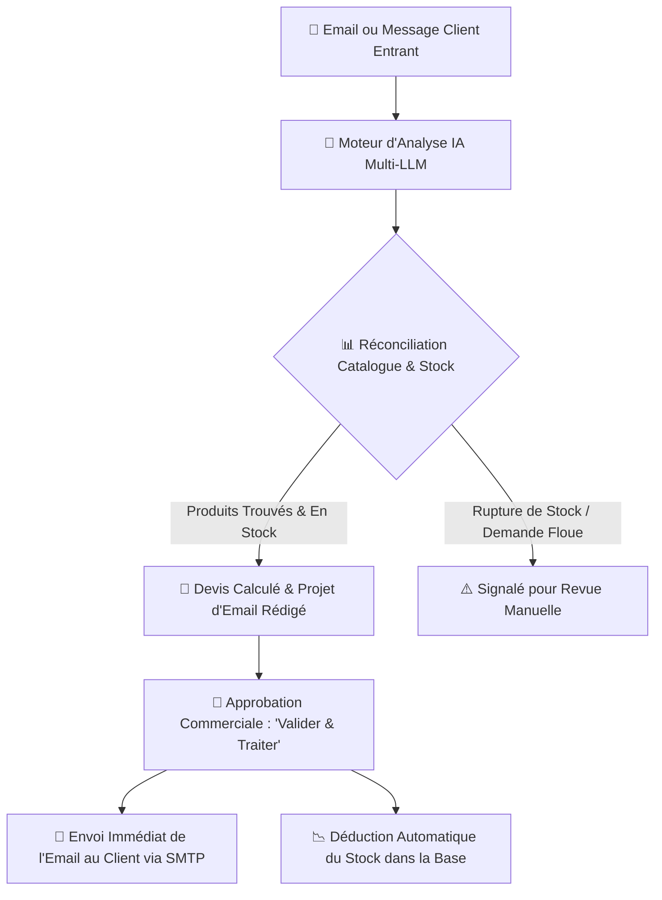

<div align="center">

# ⚡ Cockpit IA — Plateforme d'Automatisation Commerciale & Gestion des Stocks

**Micro-SaaS intelligent et local-first conçu pour les distributeurs B2B, grossistes, négoces et PME afin d'automatiser le traitement des demandes entrantes, le chiffrage des devis, la déduction des stocks et l'envoi d'emails en quelques secondes.**

[](https://nextjs.org/)
[](https://www.typescriptlang.org/)
[](https://tailwindcss.com/)
[](https://www.electronjs.org/)
[](https://opensource.org/licenses/MIT)
[]()

[Fonctionnalités](#-fonctionnalités-clés) • [Architecture](#-architecture-du-système) • [Démarrage Rapide](#-démarrage-rapide) • [Application Bureau](#-application-bureau-windows-electron) • [Paramètres & Connecteurs](#-paramètres--connecteurs) • [Guide de Release GitHub](#-guide-de-publication-dune-release-github)

---

</div>

## 📌 Présentation Générale

Les PME et entreprises commerciales reçoivent chaque jour des dizaines d'emails désorganisés et non structurés (ex: *« Bonjour, il me faudrait 4 perceuses 18V et 15 boîtes de vis pour notre chantier de demain »*). Les équipes commerciales passent **30% à 40% de leur journée** à chercher manuellement les références dans des fichiers Excel, recalculer les montants HT et rédiger des emails de devis.

**Cockpit IA résout définitivement ce problème :**
1. **Lecture & Compréhension :** Traitement automatique du langage naturel pour extraire le nom du client, son adresse email, l'intention, le niveau d'urgence et les articles demandés.
2. **Réconciliation avec le Stock Réel :** Rapprochement instantané entre les termes du client et votre catalogue officiel (SKU, Prix Unitaire € HT, Stock disponible).
3. **Chiffrage & Rédaction :** Calcul précis du devis et rédaction automatique d'une réponse par email professionnelle et polie.
4. **Validation en 1 Clic (Human-in-the-Loop) :** Le commercial vérifie, clique sur **« Valider & Traiter »**, et Cockpit expédie l'email officiel au client via SMTP/Nodemailer tout en déduisant le stock en temps réel.

---

## 🌟 Fonctionnalités Clés

- **🛡️ Contrôle Total Human-in-the-Loop :** Aucune action critique n'est envoyée sans validation humaine. Vous gardez 100% de la maîtrise.
- **📦 Moteur de Catalogue & Gestion des Stocks :**
  - Importation par glisser-déposer de fichiers **Excel (.xlsx, .xls)** et **CSV** via SheetJS.
  - Synchronisation en 1 clic avec des liens publics **Google Sheets**, OneDrive, SharePoint ou CSV en ligne.
  - Déduction automatique des stocks dès la validation du devis.
- **🧠 Cœur IA Multi-Modèles (Multi-LLM) :**
  - Connecteurs natifs pour **Google Gemini**, **OpenAI (GPT-4o/o3)**, **Anthropic (Claude 3.5)**, **Groq**, **Mistral AI**, **xAI Grok**, et modèles locaux **Ollama**.
  - Moteur de simulation intelligent permettant des démonstrations complètes même sans clé API.
- **📬 Messagerie Professionnelle (Envoi & Réception) :**
  - Transport SMTP haute délivrabilité via **Nodemailer** (optimisé pour **turboSMTP**, Google Workspace / Gmail et Microsoft Outlook 365).
  - Relève automatique des boîtes de réception via IMAP.
- **🖥️ Double Mode de Déploiement :**
  - **Mode Web / SaaS :** Utilisable dans n'importe quel navigateur moderne ou déployable sur serveur.
  - **Application Bureau Windows (.exe / .msi) :** Package autonome avec Electron et installeur NSIS pour un usage 100% local et sécurisé.

---

## 🏛️ Architecture du Système



---

## 🚀 Démarrage Rapide

### Prérequis
- [Node.js](https://nodejs.org/) (version 18.x ou 20.x recommandée)
- [npm](https://www.npmjs.com/) (inclus avec Node.js)
- [Git](https://git-scm.com/)

### 1. Cloner le Répertoire
```bash
git clone https://github.com/ellsimohammed8-prog/Cockpit-IA.git
cd Cockpit-IA
```

### 2. Installer les Dépendances
```bash
npm install
```

### 3. Lancer le Serveur de Développement Web
```bash
npm run dev
```
Ouvrez votre navigateur sur `http://localhost:3000`.

---

## 💻 Application Bureau Windows (Electron)

Cockpit IA est entièrement configuré pour fonctionner et être compilé comme une application de bureau Windows native.

### Lancer en Mode Bureau (Développement)
```bash
npm run electron:dev
```
*Cette commande démarre le serveur local Next.js et ouvre automatiquement la fenêtre native Electron.*

### Compiler le Fichier d'Installation Windows (.exe & .msi)
```bash
npm run build:desktop
```
Une fois la compilation terminée, les exécutables d'installation se trouvent dans le dossier `dist/` :
- `dist/Cockpit IA Setup 0.1.0.exe` (Installeur officiel NSIS avec raccourci sur le Bureau)
- `dist/win-unpacked/Cockpit IA.exe` (Version portable autonome exécutable directement)

---

## ⚙️ Paramètres & Connecteurs

Cliquez sur le bouton **« Paramètres »** pour configurer vos services :

### 1. 🧠 Moteur IA
- Sélectionnez votre fournisseur (Google Gemini, OpenAI, Claude, Groq, Mistral, Ollama).
- Testez la connexion et récupérez les modèles disponibles en direct via le bouton **« ⚡ Tester la Connexion »**.
- Personnalisez le prompt système selon les spécificités de votre activité.

### 2. 📬 Messagerie Professionnelle (SMTP & IMAP)
- **turboSMTP / Serveur Dédié (Recommandé) :** Saisissez l'hôte SMTP (`pro.eu.turbo-smtp.com`), le port (`465`), l'identifiant et le mot de passe.
- **Gmail / Google Workspace :** Utilisez un mot de passe d'application généré sur [myaccount.google.com/apppasswords](https://myaccount.google.com/apppasswords).
- **Microsoft Outlook 365 :** Utilisez votre mot de passe d'application Microsoft.
- Testez l'expédition en direct avec le bouton **« ⚡ Tester la Connexion & Envoi »**.

### 3. 📊 Catalogue & Gestion des Fichiers
- Glissez-déposez n'importe quel fichier `.xlsx`, `.xls` ou `.csv` comportant vos colonnes (*SKU, Nom, Quantité, Prix HT, Catégorie*).
- Ou collez l'URL publique d'un Google Sheets ou fichier Excel en ligne pour synchroniser vos références en 1 clic.

### 4. 🗄️ Base de Données
- **Stockage Local :** Aucune configuration requise pour démarrer immédiatement.
- **Supabase Cloud (REST) :** Pour une persistance Cloud sécurisée.
- **PostgreSQL Dédié :** Connexion directe avec support SSL.

---

## 📦 Guide de Publication d'une Release GitHub

Pour distribuer le fichier d'installation `.exe` à vos clients via GitHub Releases :

1. **Compiler l'installeur de bureau :**
   ```bash
   npm run build:desktop
   ```
2. **Pousser les modifications sur GitHub :**
   ```bash
   git add .
   git commit -m "docs: mise à jour du README en français"
   git push origin main
   ```
3. **Créer la Release sur GitHub :**
   - Rendez-vous sur votre dépôt GitHub : [https://github.com/ellsimohammed8-prog/Cockpit-IA](https://github.com/ellsimohammed8-prog/Cockpit-IA)
   - Dans la colonne de droite, cliquez sur **Releases** puis sur **Draft a new release**.
   - **Tag version :** `v0.1.0` (Sélectionnez *Create new tag: v0.1.0 on main*).
   - **Titre de la Release :** `Cockpit IA v0.1.0 — Version Bureau Windows`
   - **Description :** Collez un résumé des fonctionnalités de la version.
   - **Joindre le binaire :** Glissez-déposez le fichier `dist/Cockpit IA Setup 0.1.0.exe` dans la zone de dépôt des binaires.
   - Cliquez sur **Publish release**.

---

## 🛡️ Sécurité & Confidentialité

- Toutes les clés d'API, mots de passe et identifiants restent stockés localement sur votre machine ou votre base de données privée.
- Les champs de mot de passe sont masqués par défaut (`type="password"`) avec bouton d'affichage 👁️.
- Les connexions SMTP sortantes utilisent le chiffrement SSL/TLS.

---

## 📄 Licence

Ce projet est sous licence **MIT** — vous êtes libre de l'utiliser et de le personnaliser pour vos projets commerciaux ou personnels.
